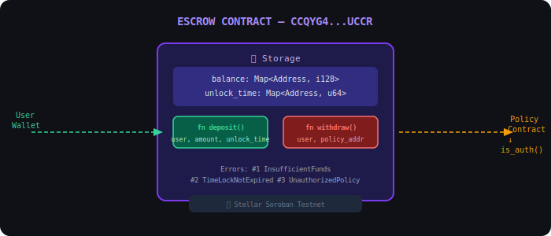
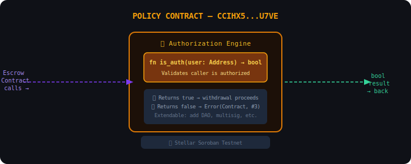
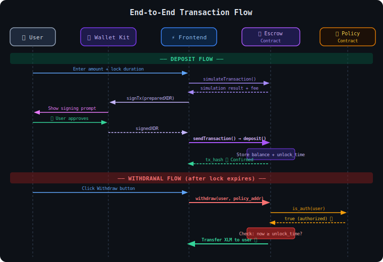
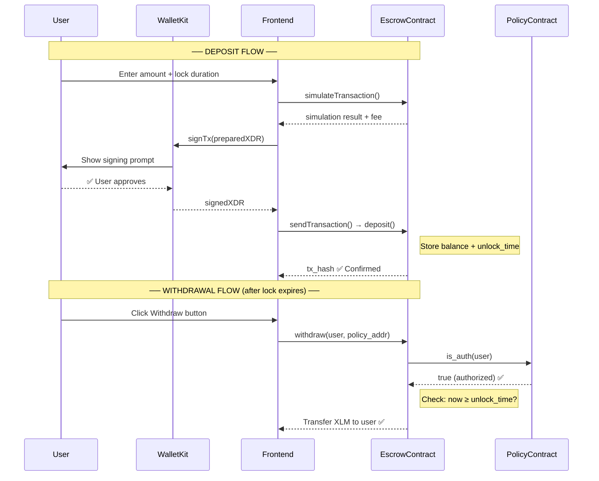
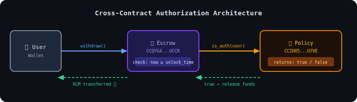

# ⏳ StellarFlow — Time-Locked Escrow Vault

> **Lock your XLM in a cryptographically enforced time-locked smart contract on Stellar Testnet. Not even you can touch it until the time expires.**

[](https://github.com/Be-bibek/web3-TimeLockNotExpired/actions)
[](https://testnet.steexp.com)
[](LICENSE)

---

## 📋 Table of Contents
- [What It Does](#-what-it-does)
- [Smart Contract Architecture](#-smart-contract-architecture)
  - [Escrow Contract](#1-escrow-contract)
  - [Policy Contract](#2-policy-contract)
  - [Transaction Flow Diagram](#-transaction-flow)
  - [Cross-Contract Auth Flow](#-cross-contract-authorization-flow)
- [Tech Stack](#-tech-stack)
- [Getting Started](#-getting-started)
- [CI/CD Pipeline](#-cicd-pipeline)
- [Testing](#-testing)

---

## 🔐 What It Does

StellarFlow Vault allows users to **lock XLM in a Soroban smart contract** with a strict time lock. The funds are:
- **Completely inaccessible** until the time lock expires — even by the depositor
- **Protected by cross-contract policy** — a second smart contract enforces the withdrawal rules
- **Fully on-chain** — no centralized backend; all logic lives in Soroban contracts on Stellar

**Real Example:** Lock 50 XLM for 10 years → The blockchain guarantees no one can touch those funds until 2036.

---

## 🏗 Smart Contract Architecture

This project deploys **two interconnected Soroban smart contracts** on Stellar Testnet.

### 1. Escrow Contract
**Address:** `CCQYG4ISLQD4KOSGWEN3YBP5FOLIT34V2EMJVKRERW2ZC5AE6JPSUCCR`

[🔍 View on Stellar Expert](https://stellar.expert/explorer/testnet/contract/CCQYG4ISLQD4KOSGWEN3YBP5FOLIT34V2EMJVKRERW2ZC5AE6JPSUCCR)

This is the **main vault contract**. It stores the user's XLM balance and the timestamp of when it was locked. It has two public functions:

| Function | Arguments | Description |
|---|---|---|
| `deposit(user, amount, unlock_time)` | `Address`, `i128`, `u64` | Locks XLM into the vault with a specific UNIX timestamp unlock time |
| `withdraw(user, policy)` | `Address`, `Address` | Withdraws funds **only after** calling the Policy contract for authorization |

**Custom Error Codes (L2):**
| Error Code | Name | Meaning |
|---|---|---|
| `#1` | `InsufficientFunds` | No balance is locked in escrow for this user |
| `#2` | `TimeLockNotExpired` | The time lock is still active — withdrawal blocked |
| `#3` | `UnauthorizedPolicy` | The policy contract rejected the withdrawal |



---

### 2. Policy Contract
**Address:** `CCIHX5MY44KTE3MKLUIAOYGBA3NHRF6DTPPGVSDHQPZHGRVCCNMOU7VE`

[🔍 View on Stellar Expert](https://stellar.expert/explorer/testnet/contract/CCIHX5MY44KTE3MKLUIAOYGBA3NHRF6DTPPGVSDHQPZHGRVCCNMOU7VE)

This is the **governance/authorization contract** (L3 Cross-Contract Architecture). When the Escrow contract receives a `withdraw` call, it does NOT immediately pay out. Instead, it first calls this Policy contract's `is_auth` function and only proceeds if authorization is granted.

| Function | Arguments | Description |
|---|---|---|
| `is_auth(user)` | `Address` | Returns `true` if the caller is authorized to receive the withdrawal |



---

### 🔄 Transaction Flow

The complete end-to-end flow for a **Deposit** and a **Withdrawal**.



#### GitHub Native Mermaid Sequence Diagram



---

### 🔒 Cross-Contract Authorization Flow

The most critical piece of the L3 architecture: when `withdraw()` is called on the Escrow contract, it **cannot** release funds on its own. It must first call the Policy contract's `is_auth()` function. This design means:

1. **The withdrawal rule is governed externally** — you can upgrade or replace the Policy contract without touching the Escrow.
2. **Future extensibility** — the Policy could be replaced with a DAO vote, a multisig, or any other on-chain governance logic.
3. **Security** — the Escrow never has unilateral control over withdrawals.



#### GitHub Native Mermaid Architecture Flow

```mermaid
graph LR
    A[👤 User Wallet] -->|withdraw()| B
    subgraph L2 Architecture
        B[📦 Escrow Contract <br> CCQYG4...UCCR] 
        C[🔑 Policy Contract <br> CCIHX5...U7VE]
    end
    B -->|is_auth(user)| C
    C -.->|returns: true/false| B
    B -.->|If true & unlock_time passed<br>XLM transferred ✅| A
    style B fill:#1e1b4b,stroke:#7c3aed,stroke-width:2px,color:#c4b5fd
    style C fill:#1c1008,stroke:#d97706,stroke-width:2px,color:#fcd34d
```

---

## 🛠 Tech Stack

| Layer | Technology |
|---|---|
| **Smart Contracts** | Rust + Soroban SDK (Stellar) |
| **Blockchain Network** | Stellar Soroban Testnet |
| **Frontend Framework** | Next.js 16 (App Router) |
| **Wallet Integration** | `@creit.tech/stellar-wallets-kit` v2.5 |
| **State Management** | Zustand |
| **Styling** | Tailwind CSS v4, Framer Motion |
| **Testing** | Jest + ts-jest |
| **CI/CD** | GitHub Actions |

---

## 🚀 Getting Started

### Prerequisites
- Node.js v18+
- A Stellar-compatible wallet (Freighter, Albedo, or any WalletConnect wallet like xBull, Lobstr)

### Installation

```bash
git clone https://github.com/Be-bibek/web3-TimeLockNotExpired.git
cd web3-TimeLockNotExpired
npm install
npm run dev
```

Open [http://localhost:3000](http://localhost:3000) in your browser.

### Mobile Testing
WalletConnect requires HTTPS. To test on mobile, tunnel your local server:

```bash
# In a second terminal
npx -y cloudflared tunnel --url http://127.0.0.1:3000
```

Open the `https://....trycloudflare.com` URL on your mobile device.

> **Note:** Make sure both `npm run dev` AND `cloudflared` are running in **separate terminals** simultaneously.

---

## ⚙️ CI/CD Pipeline

This project uses **GitHub Actions** for continuous integration. Every push to `main` automatically:

1. ✅ Installs dependencies
2. ✅ Runs the full TypeScript type check (`tsc --noEmit`)
3. ✅ Runs all contract and wallet unit tests (`npm test`)
4. ✅ Builds the production Next.js bundle (`npm run build`)

See [`.github/workflows/ci.yml`](.github/workflows/ci.yml) for the workflow configuration.

---

## 🧪 Testing

Tests cover:
- **XLM → Stroops conversion accuracy**
- **Time lock calculation** (including 10-year lock validation)
- **L2 custom error code parsing** (`#1 InsufficientFunds`, `#2 TimeLockNotExpired`, `#3 UnauthorizedPolicy`)
- **Input validation** (public key format, zero-amount guard)
- **Contract ID configuration** (valid C-prefixed Stellar contract addresses)
- **Wallet store** (connect/disconnect state management)

```bash
npm test              # Run all tests
npm run test:coverage # Generate coverage report
```
